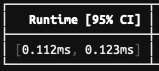
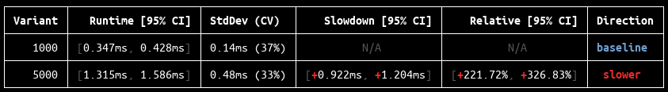

# tachometer

> tachometer is a tool for running benchmarks in web browsers. It uses repeated
sampling and statistics to reliably identify even the smallest differences in
timing.

## Why?

Benchmarking is *hard*. Even if you run the exact same JavaScript, on the same
browser, on the same machine, on the same day, you will likely get a
significantly different result every time you measure. For this reason, at first
pass, it is often very difficult to say anything meaningful about the
performance of a script.

But there is signal in the noise. Scripts do have true underlying performance
characteristics on average. By taking enough *repeated samples* and applying the
right statistics, we can reliably identify small differences and quantify our
confidence in them.

## Quick Start

1. Install tachometer from NPM.

  ```sh
  $ npm i tachometer
  ```

2. Make a folder for your benchmarks. tachometer expects a particular file
   layout (explained [below](#folder-layout)).

  ```sh
  $ mkdir benchmarks/
  $ cd benchmarks/
  $ mkdir -p default/forloop
  $ vim default/forloop/index.html
  ```

3. Create a simple benchmark that just executes a for loop. tachometer
   benchmarks are just HTML files that import and call `bench.start()` and
   `bench.stop()`.

  ```html
  <html>
  <body>
  <script type="module">
    import * as bench from '/bench.js';
    bench.start();
    for (let i = 0; i < 1000; i++) { }
    bench.stop();
  </script>
  </body>
  </html>
  ```

4. Launch tachometer, which will automatically find your benchmark, launch
   Chrome, and execute the benchmark 50 times.

  ```sh
  $ tachometer
  ```

  Along with some other information, tachometer will show you a range of
  plausible values for how long this benchmark takes to run (more precisely, a
  *95% confidence interval*, which is explained [below]()).

  

## Features

The above quick start shows the simplest way to use tachometer, but it can do
much more.

- *Compare benchmarks*. Run any number of benchmarks in the same session, see
  which ones were faster or slower, and by how much. Compare different
  benchmarks, different browsers, and different implementations or
  configurations of the same benchmark. See [multiple
  benchmarks](#multiple-benchmarks).


- *Configure different versions* of the same NPM dependency that your
  benchmark uses. Compare competing implementation ideas, or detect
  regressions. See [package versions](#package-versions).


- *Configure variants* of a benchmark from the command-line. For example we
  can make the number of iterations in the example above a parameter so that
  it can be configured from a JSON config file. See [variants](#variants).


- *Automatically continue sampling* until we have enough precision to answer the
  question you are asking. See [auto sampling](#auto-sampling).

## One benchmark

When you execute just one benchmark, you'll get a table with one main result
column: the ***runtime*** of the benchmark, presented as a *95% confidence
interval* (see [below](#confidence-intervals) for interpretation) for the number
of milliseconds that elapsed between `bench.start()` and `bench.stop()`.

</img>

## Multiple benchmarks

When you run multiple benchmarks together in the same session, you'll get a
table with 1 row per benchmark, and 3 main result columns per row:

1. The ***runtime*** of each benchmark.
2. The ***absolute difference*** versus the baseline (*"slowdown"* column).
3. The ***percent difference*** versus the baseline (*"relative"* column).

</img>

## Baseline

The ***baseline*** is the result that the *difference* confidence intervals are
relative to. The absolute difference is `result - baseline`, and the percent
difference is `(result - baseline) / baseline`. Positive numbers (red) indicate
a *slowdown* versus the baseline, and negative numbers (green) indicate a
*speedup* versus the baseline. By default the *fastest* benchmark is chosen as
the baseline, but you can change that with the `--baseline` flag.

Baseline flag option                | Description
------------------------------------| -------------------------------
`fastest`                           | Use the lowest estimated mean runtime as the baseline.
`slowest`                           | Use the highest estimated mean runtime as the baseline.
`name=<name>,version=<version>,...` | One or more comma-delimited `key=val` filters for narrowing down the baseline. At least one filter is required, and an error will be thrown if the selection is ambiguous. Valid filter keys: `name`, `variant`, `implementation`, `version`, `browser`.

## Folder layout

```
<root>/
└── <implementation>/
    ├── package.json
    └── <benchmark>/
        ├── index.html
        └── index.js
```

The **root** directory is where tachometer looks for your benchmarks. By default
it is the current working directory, but you can change it with the `--root`
flag (see [flags](#flags)).

Benchmarks are next organized into **implementation** directories, each with
their own optional `package.json`. Since one supported use cases is to compare
equivalent benchmarks using different underlying implementations, this layer
exists to isolate those NPM dependencies. For simple use cases, you can just
create a `default` (or any name) directory with no `package.json`.

Finally, each **benchmark** directory contains a benchmark. Each benchmark
directory must have an `index.html` file, which is what tachometer will launch.

## Variants

We often want to compare multiple versions of the same benchmark implementation,
but with different configuration parameters. For example, we might want to see
how the performance of some function scales with 1, 100, and 1000 invocations.
Instead of writing a new benchmark for each of these numbers, we can instead use
a configuration file to define ***variants***.

If a `benchmarks.json` file is found in a `<benchmark>` directory, then it will
be read to look for a list of variants in the following format:

Field             | Description
------------------| -------------------------------
`variants`        | A list of variant objects for this benchmark
`variants.name`   | A label for this variant for use on the command-line
`variants.config` | An arbitrary object which will be passed to the benchmark function as `bench.config`

For example, we might have this `benchmarks.json`:

```js
{
  "variants": [
    {
      "name": "small",
      "config": {
        "iterations": 1
      }
    },
    {
      "name": "medium",
      "config": {
        "iterations": 100
      }
    },
    {
      "name": "large",
      "config": {
        "iterations": 1000
      }
    }
  ]
}
```

With an implementation like this:

```js
bench.start();
for (let i = 0; i < bench.config.iterations; i++) {
  doSomething();
}
bench.stop();
```

## Package Versions

By default, the version of a dependency library that a benchmark runs against is
the one installed by NPM according to the implementation directory's
`package.json` (usually the latest stable release).

However, it is often useful to run a benchmark on a specific dependency version,
or across *multiple versions of the same dependency*, e.g. to see the difference
between two different published versions, or between the GitHub master branch
and a local development branch.

Use the `--package-version` flag to specify a different version of a dependency
library to install and run against, instead of the default one. To specify
multiple versions, use the flag multiple times. The format of this flag is:

`<implementation>/<label>=<pkg>@<version>[,<pkg@version>],...]`

Part              | Description
----------------- | -----------
`implementation`  | The implementation directory name whose dependencies we are changing (e.g. `lit-html`).
`label`           | An arbitrary concise name for this version (e.g. `master`, `local`, `1.x`).
`pkg`             | The NPM package name (e.g. `lit-html`). Must already appear in the implementation's `package.json`.
`version`         | Any valid [NPM version descriptor](https://docs.npmjs.com/files/package.json#dependencies) (e.g. `Polymer/lit-html#master`, `$HOME/lit-html`, `^1.0.0`).

For example, here we configure 3 versions of `lit-html` to run benchmarks
against: the GitHub master branch, a local development git clone, and the latest
1.x version published to NPM:

```sh
npm run benchmarks --
--package-version=lit-html/master=lit-html@github:Polymer/lit-html#master \
--package-version=lit-html/local=lit-html@$HOME/lit-html \
--package-version=lit-html/1.x=lit-html@^1.0.0
```

When you use the `--package-version` flag, the following happens:
- A directory `<implementation>/versions/<label>` is created.
- A copy of `<implementation>/package.json` is written to `.../<label>/package.json`
  and modified according to the new dependency versions you specified.
- `npm install` is run in this directory.
- Benchmarks are run from URLs of the form `<implementation>/versions/<label>`.
  URL paths within `node_modules/` are served from the version directory (to get
  your new versions), while other URLs (i.e. the benchmarks themselves) are
  mapped back to the main `<implementation>` directory.

## Confidence intervals

The most important concept needed to interpret results from tachometer is the
***confidence interval***. Loosely speaking, a confidence interval is a range of
*plausible values* for a parameter (e.g. runtime), and the *confidence level*
(which we fix at *95%*) corresponds to the degree of confidence we have that
interval contains the *true value* of that parameter.

> More precisely, the 95% confidence level describes the *long-run proportion of
> confidence intervals that will contain the true value*. Hypothetically, if you
> run tachometer over and over again in the same configuration, then while you'll
> get a slightly different confidence interval every time, it should be the case
> that *95% of those confidence intervals will contain the true value*. See
> [Wikipedia](https://en.wikipedia.org/wiki/Confidence_interval#Meaning_and_interpretation)
> for more information on interpreting confidence intervals.

The *width* of a confidence interval determines the range of values it includes.
Narrower confidence intervals give you a more precise estimate of what the true
value might be. In general, we want narrower confidence intervals.

```
    <------------->   Wider confidence interval
                      High variance and/or low sample size

         <--->   Narrower confidence interval
                 Low variance and/or high sample size

 |---------|---------|---------|---------|
-1%      -0.5%       0%      +0.5%      +1%
```

Three knobs can shrink our confidence intervals:

1. Dropping the chosen confidence level. *This is not a good idea!* We want our
   results to be *consistently reported with high confidence*, so we always use
   95% confidence intervals.


2. Decreasing the variation in the benchmark timing measurements. *This is hard
   to do*. A great many factors lead to variation in timing measurements, most
   of which are very difficult to control, including some that are
   [intentionally built
   in](https://developers.google.com/web/updates/2018/02/meltdown-spectre#high-resolution_timers)!


3. Increasing the sample size. The [central limit
   theorem](https://en.wikipedia.org/wiki/Central_limit_theorem) means that,
   even when we have high variance data, and even when that data is not normally
   distributed, as we take more and more samples, we'll be able to calculate a
   more and more precise estimate of the true mean of the data. *Increasing the
   sample size is the main knob we have.*

## Sample size

By default, a minimum of 50 samples are taken from each benchmark. The
preliminary results from these samples may or may not be precise enough to allow
you to to draw a statistically significant conclusion.

> For example, if you are interested in knowing which of A and B are faster, but
> you find that the confidence interval for the percent change between the mean
> runtimes of A and B *includes zero* (e.g. `[-3.08%, +2.97%]`), then it is
> clearly not possible to draw a conclusion about whether A is faster than B or
> vice-versa.

You can increase the sample size with the `--sample-size` flag, or you can
enable *auto-sampling*.

## Auto sampling

When the `--auto-sample` flag is set, tachometer will continue drawing samples until
either certain stopping conditions that you specify are met, or until a timeout
expires (5 minutes by default).

The stopping conditions for auto-sampling are specified in terms of
***targets***. A target can be thought of as a *point of interest* on the
number-line of either absolute or relative differences in runtime. By setting a
target, you are asking tachometer to try to *shrink the confidence interval until
it is unambiguously placed on one side or the other of that target*.

Example targets    | Question
------------------ | -----------
`0%`               | Is X faster or slower than the baseline *at all*?
`10%`              | Is X faster or slower than the baseline by at least 10%?
`+10%`             | Is X slower than the baseline by at least 10%?
`-10%`             | Is X faster than the baseline by at least 10%?
`-10%,+10%`        | (Same as `10%`)
`0%,10%,100%`      | Is X at all, a little, or a lot slower or faster than the baseline?
`0.5ms`            | Is X faster or slower than the baseline by at least 0.5 milliseconds?

In the following visual example, we have set `--targets=10%` meaning that we are
interested in knowing whether A differs from B by at least 10% in either
direction. The sample size automatically increases until the confidence interval
is narrow enough to place the estimated difference squarely on one side or the
other of both targets.

```
      <------------------------------->     n=50  ❌ -10% ❌ +10%
                <------------------>        n=100 ✔️ -10% ❌ +10%
                    <----->                 n=200 ✔️ -10% ✔️ +10%

  |---------|---------|---------|---------| difference in runtime
-20%      -10%        0       +10%      +20%

n     = sample size
<---> = confidence interval for percent difference of mean runtimes
✔️    = resolved target
❌    = unresolved target
```

In the example, by `n=50` we are not sure whether A is faster or slower than B
by more than 10%. By `n=100` we have ruled out that B is *faster* than A by more
than 10%, but we're still not sure if it's *slower* by more than 10%. By `n=200`
we have also ruled out that B is slower than A by more than 10%, so we stop
sampling. Note that we still don't know which is *absolutely* faster, we just
know that whatever the difference is, it is neither faster nor slower than 10%
(and if we did want to know, we could add `0` to our targets).

Note that, if the actual difference is very close to a target, then it is
likely that the precision stopping condition will never be met, and the timeout
will expire.

## Flags

Flag                      | Default     | Description
------------------------- | ----------- | --------------------------------
`--help`                  | `false`     | Show documentation
`--root`                  | `./`        | Root directory to search for benchmarks
`--host`                  | `127.0.0.1` | Which host to run on
`--port`                  | `0`         | Which port to run on (`0` for random free)
`--name` / `-n`           | `*`         | Which benchmarks to run (`*` for all) ([details](#adding-benchmarks))
`--implementation` / `-i` | `*`         | Which implementations to run (`*` for all) ([details](#adding-benchmarks))
`--variant` / `-v`        | `*`         | Which variants to run (`*` for all) ([details](#variants))
`--package-version` / `-p`| *(none)*    | Specify one or more dependency versions ([details](#versions))
`--browser` / `-b`        | `chrome`    | Which browsers to launch in automatic mode, comma-delimited (chrome, firefox)
`--baseline`              | `fastest`   | Which result to use as the baseline for comparison ([details](#comparison))
`--sample-size` / `-n`    | `50`        | Minimum number of times to run each benchmark
`--auto-sample`           | `false`     | Continuously sample until all runtime differences can be placed, with statistical significance, on one side or the other of all specified `--targets` points ([details](#sample-size))
`--targets`               | `0%`        | The targets to use when `--auto-sample` is enabled (milliseconds, comma-delimited) ([details](#sample-size))
`--timeout`               | `5`         | The maximum number of minutes to spend auto-sampling ([details](#sample-size))
